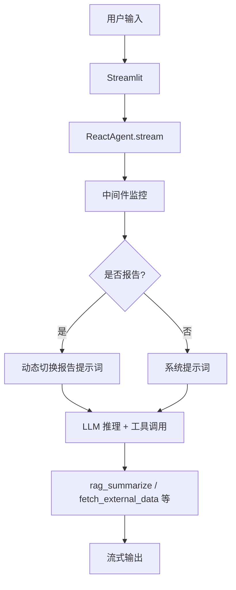

# 智扫通机器人智能客服系统

**🤖 基于 LangChain/LangGraph 的ReAct Agent 智能客服**
- 提供“智扫通”扫地机器人用户以智能问答与个性化服务。系统集成 RAG 知识库、自定义工具链、动态提示词切换和 Streamlit 实时聊天界面，实现从普通产品咨询到月度效率/耗材报告的全链路自动化处理。

**🌟 项目亮点**

* **ReAct + LangGraph**：完整 ReAct 循环（Reason → Act → Observe），底层使用 LangGraph 图结构，支持长时状态与流式输出。
* **动态提示词切换**：通过自定义中间件（`@dynamic_prompt`）在报告场景自动注入上下文，普通问答 vs 报告生成无缝切换。
* **RAG 知识库**：Chroma 向量存储 + BGE/DashScope 嵌入，MD5 去重防止重复加载，支持 PDF/TXT 智能硬件文档检索。
* **个性化报告**：自动调用 `fetch_external_data` 从 CSV 拉取用户 ID/月份数据，生成结构化特征、效率、耗材对比报告。
* **生产级特性**：全链路日志监控、工具执行拦截、Streamlit 流式渲染与会话持久化。
* **快速部署**：一行命令启动，支持 Docker 扩展，模拟真实电商/硬件客服场景。

**🚀 在线演示**（可选添加截图或 Hugging Face/Streamlit Cloud 链接）


## ✨ 核心功能

* 产品知识问答（RAG 检索 + 总结，如“小户型适合哪些扫地机器人”）。
* 个性化使用报告生成（输入“给我生成我的使用报告” → 自动切换报告提示词 + 拉取外部 CSV 数据）。
* 多工具集成：天气查询、用户位置/ID/月份模拟、外部数据拉取。
* 实时流式输出 + 思考动画 + 历史记录持久化。
* 知识库自动加载与去重（支持 data/ 文件夹 PDF/TXT）。

## 🛠️ 技术栈

| 组件       | 技术                           | 作用                     |
| -------- | ---------------------------- | ---------------------- |
| LLM      | ChatTongyi (阿里通义)            | 核心推理模型                 |
| Agent 框架 | LangChain + LangGraph        | ReAct 循环与 create_agent |
| 向量数据库    | Chroma                       | RAG 持久化索引              |
| 前端       | Streamlit                    | 聊天界面 + 流式输出            |
| 嵌入模型     | DashScopeEmbeddings          | 文档向量生成                 |
| 配置与工具    | YAML + 自定义 @tool             | 动态工具与中间件               |
| 其他       | PyPDFLoader, MD5 去重, logging | 文档加载与生产日志              |

## 📦 安装与配置

### 前置要求

* Python 3.10+
* 通义千问 API Key（或本地模型）

### 步骤

```bash
# 1. 克隆仓库
git clone https://github.com/你的用户名/zhisaotong-agent.git
cd zhisaotong-agent

# 2. 创建虚拟环境并安装依赖
python -m venv venv
source venv/bin/activate  # Windows: venv\Scripts\activate
pip install -r requirements.txt

# 3. 准备配置文件（config/ 目录下 rag.yml、chroma.yml、agent.yml、prompts.yml）
# 示例：修改 chat_model_name 为你的模型

# 4. 放入知识库文档（data/ 文件夹，支持 PDF/TXT）
# 5. 准备外部 CSV 数据（agent_conf["external_data_path"] 配置路径）
```

### 启动

```bash
streamlit run streamlit_app.py
```

访问 [http://localhost:8501](http://localhost:8501) 即可聊天。

**环境变量**（可选，放入 .env 或系统变量）：

```
DASHSCOPE_API_KEY=your_key
```

## 📖 使用示例

1. **普通问答**
   输入：`小户型适合哪些扫地机器人`
   系统自动调用 `rag_summarize` 工具检索知识库并总结回复。

2. **报告生成**（核心演示）
   输入：`给我生成我的使用报告`

   * 先触发 `fill_context_for_report` 工具
   * 中间件设置 `context["report"] = True`
   * 动态切换为报告专用提示词
   * 连续调用 `get_user_id`、`get_current_month`、`fetch_external_data` 生成结构化报告

3. **多轮对话**
   系统自动保留上下文，支持连续追问。

## 📁 项目结构

```
zhisaotong-agent/
├── agent/
│   ├── react_agent.py          # ReactAgent 类 + create_agent
│   └── tools/
│       ├── agent_tools.py      # 所有 @tool 定义（RAG、天气、报告等）
│       └── middleware.py       # monitor_tool / log_before_model / report_prompt_switch
├── rag/
│   ├── rag_service.py          # RAG 总结链
│   └── vector_store.py         # Chroma 初始化 + MD5 去重加载
├── streamlit_app.py            # 主界面（历史 + 流式捕获）
├── config/                     # YAML 配置文件
├── data/                       # 知识库文档
├── external_data.csv           # 用户使用记录
├── utils/                      # 路径、日志、加载器、MD5 等工具
├── logs/                       # 日志输出
├── requirements.txt
└── README.md
```

## 🔧 系统架构与流程



**报告模式核心**：`fill_context_for_report` → `@wrap_tool_call` 修改 runtime.context → `@dynamic_prompt` 返回 load_report_prompts()。

## 📈 生产特性与可扩展性

* **日志全覆盖**：工具执行、模型调用、错误堆栈。
* **持久化**：Chroma persist_directory + MD5 去重。
* **流式友好**：generator + Streamlit write_stream。
* **易扩展**：新增工具只需 `@tool` 并加入列表；新增场景扩展中间件即可。
* **部署建议**：Docker + LangSmith 追踪；生产可换 Pinecone / vLLM 加速。

## 🤝 贡献指南

欢迎 PR！

1. Fork 本仓库
2. 创建 feature 分支
3. 提交变更并更新 README
4. 提交 Pull Request

**问题反馈**：Issues 或 联系作者。

## 📜 License

MIT License © 2025 你的名字

## 🙏 致谢与参考

* LangChain/LangGraph 官方文档与示例
* Streamlit 官方聊天模板
* Chroma 与 DashScope 集成示例

**感谢** 所有开源贡献者！

---

**Key Citations**

* [langchain-agent-streamlit README 示例（安装、测试、Streamlit UI）](https://github.com/MartinCastroAlvarez/langchain-agent-streamlit/blob/main/README.md)
* [LangGraph 官方 README（ReAct Agent、流式、部署特性）](https://github.com/langchain-ai/langgraph/blob/main/README.md)
* [streamlit-agent 官方示例仓库（LangChain Agent Streamlit 集成模式）](https://github.com/langchain-ai/streamlit-agent/blob/main/README.md)
* [AI Agent README 最佳实践（结构、emoji、仓库结构图）](https://medium.com/@filipespacheco/i-created-an-ai-agent-to-build-readme-files-here-is-what-i-learn-3ae207771d37)
* [LangChain Agents 与 middleware 文档（@dynamic_prompt、create_agent）](https://reference.langchain.com/python/langchain/agents/middleware/types/dynamic_prompt)
* [LangChain 官方 RAG 与 Agent 指南](https://python.langchain.com/docs/tutorials/rag)
