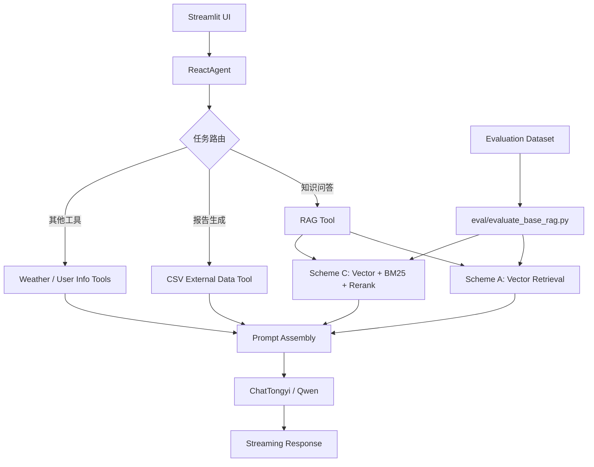

# react-rag-agent-langchain

> A LangChain + LangGraph based ReAct Agent demo for local knowledge-base QA, hybrid RAG retrieval, and lightweight retrieval evaluation.

[](https://python.org)
[](https://github.com/langchain-ai/langchain)
[](https://github.com/langchain-ai/langgraph)
[](LICENSE)

---

## 项目简介

`react-rag-agent-langchain` 是一个面向垂直知识问答场景的本地 RAG + Agent 实战项目。项目以扫地机器人领域为示例，围绕 FAQ、故障排查、维护保养、选购指南和用户使用记录等数据，搭建了一个可交互的智能客服原型。

项目核心不是单纯调用大模型，而是串联了以下完整链路：

- Streamlit 对话界面
- LangChain / LangGraph ReAct Agent 工具调用
- Chroma 本地向量知识库
- 基础向量检索方案 A
- 并行向量召回 + BM25 + 融合重排方案 C
- 检索召回率自动评测框架

当前仓库既保留了基础版 RAG，也实现了混合检索优化版，适合用于课程设计、实习项目、RAG 入门和检索策略对比实验。

---

## 核心能力

### 1. ReAct Agent 驱动的智能问答

- 基于 `create_agent(...)` 构建 ReAct Agent
- 支持工具调用、动态 Prompt 切换和流式输出
- Agent 可根据问题自动选择知识检索、外部数据查询或报告生成链路

### 2. 本地知识库 RAG

- 使用 Chroma 构建本地向量数据库
- 支持 `txt / pdf` 文档加载、切分、向量化和持久化
- 适合本地知识库问答、故障定位和使用说明检索

### 3. 混合检索优化

- 保留 A 方案：单路向量检索
- 新增 C 方案：向量检索与 BM25 并行召回
- 基于 RRF、关键词覆盖率和精确匹配 bonus 做融合重排
- 默认取 Top3 片段作为上下文送入模型

### 4. 报告生成场景

- Agent 可结合外部 CSV 记录生成用户使用报告
- 通过 middleware 动态切换系统 Prompt 和报告 Prompt
- 演示了“问答模式 / 报告模式”在同一 Agent 中的切换方式

### 5. 自动评测

- 内置 18 条标注测试集
- 支持 A / C 方案统一评测
- 覆盖 `Recall@K`、`MRR`、严格命中率等指标
- 可直接输出 A/C 对比结果，便于实验复现和调优分析

---

## 适用场景

- 本地知识库问答 Demo
- 垂直领域 RAG 检索实验
- ReAct Agent + RAG 组合实践
- 实习项目 / 课程项目展示
- 检索策略对比与评测入门

---

## 技术架构



---

## 项目流程

### 在线问答流程

1. 用户在 Streamlit 页面输入问题
2. `app.py` 调用 `ReactAgent.execute_stream()`
3. Agent 根据系统 Prompt 和工具描述决定是否调用 `rag_summarize`
4. `rag_summarize` 默认进入 C 方案混合检索
5. 检索结果组装为上下文后送入大模型生成答案
6. 前端以流式方式展示回复

### 报告生成流程

1. Agent 判断用户意图偏向报告生成
2. 调用 `fill_context_for_report()` 触发 middleware 设置 `report=True`
3. middleware 将系统 Prompt 切换为报告 Prompt
4. 调用用户 ID、月份、CSV 外部记录等工具补充上下文
5. 模型输出定制化使用报告

### 评测流程

1. 读取 `eval/base_rag_recall_dataset.json`
2. 选择方案 A、C 或 A/C 对比
3. 基于统一命中规则计算 `Recall@K` 和 `MRR`
4. 输出单方案结果或 A/C 对比结论

---

## A / C 检索方案

### 方案 A：基础向量检索

保留在 `rag/rag_service.py` 中的 `BaseRagSummarizeService`：

- Chroma 相似度检索
- 按 `config/chroma.yml` 中的 `k` 返回候选文档
- 将候选片段直接拼接给模型

适合做基础版 RAG 对照实验。

### 方案 C：并行召回 + 融合重排

默认实现位于 `rag/hybrid_retriever.py`，并在 `RagSummarizeService` 中启用：

- 向量召回 `top8`
- BM25 召回 `top8`
- 候选并集融合
- 基于以下信号重排：
  - RRF 排名分数
  - 关键词覆盖率
  - 精确匹配 bonus
- 最终取 `top3`

这套方案不重构原始数据集，直接复用当前 Chroma 中的已有 chunk，属于最小改动的混合检索版本。

---

## 当前评测结果

基于仓库内置的 18 条标注测试集，当前 A/C 两种方案在统一评测框架下的结果如下：

| 指标 | A 基础向量RAG | C 混合检索RAG | 变化 |
|---|---:|---:|---:|
| Source Recall@1 | 0.6111 | 0.6111 | 0.0000 |
| Source Recall@3 | 1.0000 | 0.8333 | -0.1667 |
| Source Recall@5 | 1.0000 | 0.8889 | -0.1111 |
| Source Recall@10 | 1.0000 | 1.0000 | 0.0000 |
| Source MRR | 0.7870 | 0.7394 | -0.0477 |
| Strict Recall@1 | 0.3333 | 0.5000 | +0.1667 |
| Strict Recall@3 | 0.6667 | 0.7778 | +0.1111 |
| Strict Recall@5 | 0.7222 | 0.8889 | +0.1667 |
| Strict Recall@10 | 0.9444 | 0.9444 | 0.0000 |
| Strict MRR | 0.5656 | 0.7034 | +0.1378 |

### 如何理解这些指标

- `Source Recall@K`：只要前 K 条结果中出现正确来源文件即可视为命中
- `Strict Recall@K`：来源文件正确且命中关键片段才算命中
- `MRR`：正确结果越靠前，数值越高

### 结论

- A 方案更擅长“把相关来源文件找回来”
- C 方案更擅长“把真正有用的片段排到前面”
- 如果目标是给大模型提供更精确的证据片段，C 方案更有价值

---

## 目录结构

```bash
react-rag-agent-langchain/
├── app.py                       # Streamlit 应用入口
├── requirements.txt            # 项目依赖
├── README.md
├── config/
│   ├── agent.yml               # Agent 相关配置
│   ├── chroma.yml              # 向量库与混合检索参数
│   ├── prompts.yml             # Prompt 文件路径配置
│   └── rag.yml                 # 模型与向量模型配置
├── data/
│   ├── 扫地机器人100问.pdf
│   ├── 扫地机器人100问2.txt
│   ├── 扫拖一体机器人100问.txt
│   ├── 故障排除.txt
│   ├── 维护保养.txt
│   ├── 选购指南.txt
│   └── external/
│       └── records.csv         # 外部结构化用户记录
├── agent/
│   ├── react_agent.py          # ReAct Agent 封装
│   └── tools/
│       ├── agent_tools.py      # Agent 工具函数
│       └── middleware.py       # 工具监控、日志、Prompt 切换
├── rag/
│   ├── rag_service.py          # A / C 两套 RAG 服务
│   ├── vector_store.py         # Chroma 向量库构建与持久化
│   └── hybrid_retriever.py     # 并行召回与融合重排
├── model/
│   └── factory.py              # Chat 模型 / Embedding 模型工厂
├── prompts/
│   ├── main_prompt.txt
│   ├── rag_summarize.txt
│   └── report_prompt.txt
├── utils/
│   ├── config_handler.py
│   ├── file_handler.py
│   ├── logger_handler.py
│   ├── path_tool.py
│   └── prompt_loader.py
└── eval/
    ├── base_rag_recall_dataset.json
    ├── evaluate_base_rag.py
    └── results/
```

---

## 技术栈

`Python` `Streamlit` `LangChain` `LangGraph` `ChromaDB` `DashScope` `Qwen` `BM25` `PyYAML` `PyPDF`

---

## 快速开始

### 1. 克隆项目

请使用你自己的 GitHub 地址，仓库名为 `react-rag-agent-langchain`：

```bash
git clone https://github.com/<your-username>/react-rag-agent-langchain.git
cd react-rag-agent-langchain
```

### 2. 安装依赖

```bash
pip install -r requirements.txt
```

如果使用国内镜像：

```bash
pip install -r requirements.txt -i https://pypi.tuna.tsinghua.edu.cn/simple
```

### 3. 配置环境变量

项目当前使用 DashScope 的聊天模型与向量模型，需要配置：

```bash
export DASHSCOPE_API_KEY="your-api-key"
```

Windows PowerShell:

```powershell
$env:DASHSCOPE_API_KEY="your-api-key"
```

### 4. 准备知识库

默认知识文件放在 `data/` 目录下，项目已内置示例语料。

如果想提前构建向量库，可运行：

```bash
python rag/vector_store.py
```

### 5. 启动应用

```bash
streamlit run app.py
```

---

## 配置说明

### `config/rag.yml`

控制模型名称：

- `chat_model_name`
- `embedding_model_name`

当前默认：

- `qwen3-max`
- `text-embedding-v4`

### `config/chroma.yml`

控制：

- Chroma 持久化目录
- 基础向量检索 `k`
- chunk 切分大小与 overlap
- 方案 C 的混合检索参数

当前默认混合检索参数：

- `hybrid_vector_k: 8`
- `hybrid_bm25_k: 8`
- `hybrid_final_k: 3`

### `config/prompts.yml`

定义 Prompt 文件路径：

- 主系统 Prompt
- RAG 总结 Prompt
- 报告生成 Prompt

### `config/agent.yml`

定义外部 CSV 数据路径：

- `external_data_path: data/external/records.csv`

---

## 如何使用

### 知识问答示例

- 扫地机器人找不到充电座怎么办？
- 建图不完整、地图错乱怎么解决？
- 电动拖布不旋转怎么办？
- 木地板适合什么样的扫拖机器人？

### 报告生成示例

- 根据我的使用记录生成一份本月使用报告
- 给我总结一下 2025-03 的使用情况

### 工具调用示例

Agent 当前已接入以下工具：

- `rag_summarize`
- `get_weather`
- `get_user_location`
- `get_user_id`
- `get_current_month`
- `fetch_external_data`
- `fill_context_for_report`

其中天气、用户位置、用户 ID 等工具是演示型 mock 工具，便于展示 Agent 的工具调用能力。

---

## 评测方式

### 评测单个方案

评测 A 方案：

```bash
python eval/evaluate_base_rag.py --scheme A
```

评测 C 方案：

```bash
python eval/evaluate_base_rag.py --scheme C
```

### 评测 A / C 对比

```bash
python eval/evaluate_base_rag.py --scheme both
```

### 自定义 K 值

```bash
python eval/evaluate_base_rag.py --scheme both --k-values 1 3 5 10
```

---

## 项目亮点

- 用一个仓库同时展示了 ReAct Agent、基础 RAG、混合检索和自动评测
- 保留了 A 基础方案，便于做消融实验和检索对比
- C 方案不重构原数据集，直接在现有向量库上叠加 BM25 与融合重排，改动小但效果清晰
- 既有问答场景，也有报告生成场景，适合写进简历或实习汇报
- 代码结构清晰，配置集中在 YAML 中，便于二次开发

---

## License

This project is licensed under the [MIT License](LICENSE).

---

