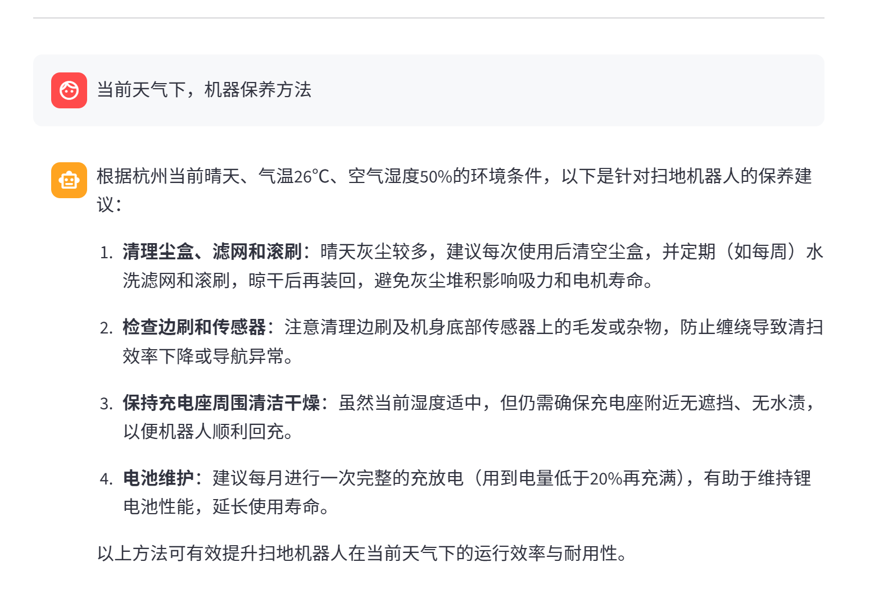

# 智扫通机器人智能客服系统 🤖
## 项目概述
- 智扫通是一个基于大语言模型的智能客服系统，专为扫地机器人场景设计（可替换）
- 系统结合了多工具智能体、RAG检索增强和流式对话等功能，能够处理用户咨询、生成使用报告等多种任务。

---

## 核心特性

#### 1) 多工具模块
- 集成天气查询、用户信息获取、外部数据检索等多种工具

#### 2) RAG检索增强
- 基于向量数据库的知识库检索，提供精准问答

#### 3) 智能报告生成
- 动态切换提示词，为用户生成个性化的使用分析报告

#### 4) 流式对话界面
- 基于Streamlit的实时聊天界面，交互流畅自然

#### 5) 模块化设计
- 工厂模式、中间件机制，易于扩展和维护

---

## 系统架构

```bash

├── agent/                       # 智能体模块
│   ├── react_agent.py           # ReAct智能体主逻辑
│   ├── tools/                   # 工具函数集合
│   └── middleware.py            # 中间件管理
├── config/                      # 配置文件
│   ├── agent.yml                # 智能体配置
│   ├── chroma.yml               # 向量库配置
│   ├── prompts.yml              # 提示词配置
│   └── rag.yml                  # RAG配置
├── data/                        # 知识库文档
├── logs/                        # 系统日志
├── model/                       # 模型层
│   └── factory.py               # 模型工厂
├── rag/                         # RAG模块
│   ├── rag_service.py           # 检索服务
│   └── vector_store.py          # 向量存储
├── utils/                       # 工具函数
│   ├── config_handler.py        # 配置加载
│   ├── file_handler.py          # 文件处理
│   ├── logger_handler.py        # 日志管理
│   ├── path_tool.py             # 路径工具
│   └── prompt_loader.py         # 提示词加载
└── app.py                       # Streamlit应用入口

```
---
## 效果预览

#### **传入日志与本地读取**


#### **生成示例：Agent工具调用**



---

## 快速开始
- 环境要求默认

- 阿里云百炼模型API密钥（或其他大模型API）

---

## 安装步骤

- 克隆项目

> git clone https://github.com/lhh737/Langchain-ReAct-Agent.git

- 安装依赖

> pip install -r requirements.txt

- 配置环境变量

- 在config目录下创建相应yml配置文件
- 或设置环境变量
> export DASHSCOPE_API_KEY="your-api-key"

- 启动应用

> streamlit run app.py

---

## 主要功能

- 智能问答：基于知识库的精准问答，支持PDF、TXT等多种格式输入

- 工具调用：集成天气、位置、用户信息等工具，实时获取信息优化大模型输出

- 上下文管理：自动切换提示词，适配不同场景

---

## 配置说明

- 系统通过YAML文件进行配置管理：

> config/agent.yml - 智能体相关配置


> config/chroma.yml - 向量数据库配置


> config/prompts.yml - 各场景提示词配置


> config/rag.yml - RAG检索配置

---

## 感谢与支持
- **Black Horse**
- Langchain/LangGraph
- Streamlit
- Chrome
- Aliyun

---

### ⭐ 本项目仅为学习与交流，如果觉得这个项目有帮助，别忘了点个Star！

---
